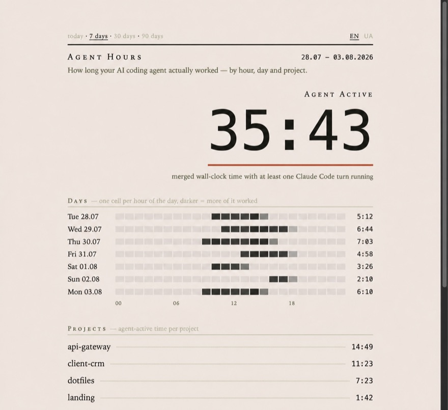

<div align="center">

# ⏱ agent-hours

**You know what Claude Code costs in tokens. Now see how long your agents stay active.**

[](LICENSE)
[](https://nodejs.org)
[](hours.mjs)
[](https://github.com/DrebotAI/agent-hours/actions/workflows/test.yml)
[](https://github.com/DrebotAI/agent-hours/stargazers)

[Install](#install) · [The two numbers](#the-two-numbers) · [Decisions](DECISIONS.md) · [Українською](docs/README_uk.md)

</div>

Every usage tracker measures dollars. This one measures agent-active time — merged
wall-clock time while Claude Code was responding, broken down by project and with
parallel sessions counted once.

One file. No dependencies. No account. Nothing leaves your machine.



```
  agent-hours                  2026-07-28..2026-08-03
  ───────────────────────────────────────────────────
  AGENT ACTIVE at least one turn running        35:43
  TURN TIME   every turn summed · ×1.23         43:46
  TURNS                                           571
  ───────────────────────────────────────────────────
  api-gateway   ████████████████████████        14:49
  client-crm    ██████████████████▌             11:23
  dotfiles      ████████████                     7:23
  landing       ██▊                              1:42
  ───────────────────────────────────────────────────
  no dependencies · nothing leaves your machine
```

`turn time` minus `agent active` is the time you had overlapping sessions.

## Install

Paste this into Claude Code and it installs itself:

```
Install agent-hours for me: https://raw.githubusercontent.com/DrebotAI/agent-hours/v1.0.1/docs/install.md
```

It will check your Node version, fetch the code, recover your history, and merge the
hooks into your `settings.json` without clobbering hooks you already have. Works the
same on macOS, Linux and Windows, because the agent handles the platform differences.

<details>
<summary>Or install it by hand</summary>

You need Node 20.1 or newer (`node --version`). No git? Download the `v1.0.1`
source ZIP from the Releases page and unpack it instead of cloning.

```sh
git clone --branch v1.0.1 --depth 1 https://github.com/DrebotAI/agent-hours.git
cd agent-hours
node hours.mjs backfill    # read the history you already have
node hours.mjs report --days 30
```

Then, to keep counting from now on:

```sh
node hours.mjs install     # prints the JSON block for your settings.json
```

It prints; it does not write. Merging into someone else's config is how you break
someone else's Claude Code, so that part stays your call. The command prints the
full path to your `settings.json` (`%USERPROFILE%\.claude\settings.json` on Windows)
and tells you whether to create the file or merge into it. Restart Claude Code afterwards.

</details>

Either way you get a number immediately — Claude Code has been writing timestamped
transcripts to `~/.claude/projects/` since the day you installed it, and `backfill`
reads them. No waiting a week to see anything.

### If the report stays empty

- **`No turns recorded yet`, and you have not run `backfill`** — run it. Nothing counts
  until either the hooks fire or history is imported.
- **Hooks added, still nothing** — Claude Code reads `settings.json` at startup, so
  restart it. Then check the file is valid JSON: `node -e "JSON.parse(require('fs').readFileSync(require('os').homedir()+'/.claude/settings.json','utf8'))"`.
- **Still nothing** — run `AGENT_HOURS_DEBUG=1` in the environment and the hook will
  print its errors instead of failing silently. On Windows: `set AGENT_HOURS_DEBUG=1`.
- **Hours look too low** — that is expected. See "The two numbers" below; this counts
  the agent's clock, not yours.

## What gets recorded

Four fields per live hook event, appended to `~/.agent-hours.jsonl`:

```json
{"at":"2026-08-03T10:14:02.117Z","source":"claude","event":"UserPromptSubmit","sessionId":"09ad8eec","cwd":"/Users/you/work/api-gateway"}
```

Your prompts, Claude's replies, tool arguments, file contents and transcripts are
never copied or sent anywhere. `backfill` reads local transcripts to extract timestamps,
message roles and the working directory; it inspects message structure only far enough
to tell a real prompt from a tool result, and stores none of the content.

There is no account and no telemetry. `serve` listens on `127.0.0.1` only — nothing
is reachable from outside your machine. The two `.jsonl` files are owner-only on
macOS and Linux. Delete them — and any HTML snapshots you exported — to remove the data.

## Commands

| Command | What it does |
| --- | --- |
| `node hours.mjs backfill` | Rebuild history from past transcripts. `report` and `serve` do this automatically when it is 15+ minutes stale; run it by hand only if you want to watch. Safe to re-run — it cannot double-count. |
| `node hours.mjs install` | Inspect settings read-only and print only missing hooks; never overwrites the file. |
| `node hours.mjs report` | Today. |
| `node hours.mjs report 2026-08-03` | One specific day. |
| `node hours.mjs report --days 7` | The last 7 days. |
| `node hours.mjs report --json` | Machine-readable, for your own scripts. `wallMinutes` is merged agent-active wall-clock time. |
| `node hours.mjs report --html` | A paper-timesheet page, written to a temp file and opened in your browser. The screenshot-friendly one. |
| `node hours.mjs statusline` | One line for the Claude Code status bar — see below. |
| `node hours.mjs serve` | The timesheet at `http://127.0.0.1:4747` — bookmark it, refresh for fresh numbers, switch periods with the links on the page. Loopback only. |

Environment: `AGENT_HOURS_FILE` moves the log, `AGENT_HOURS_DAY_START` moves the
day boundary (default `5`, so a session at 02:00 counts toward the previous day),
`AGENT_HOURS_DEBUG=1` makes the hook complain instead of failing silently.

## Hours in your status bar

Today's agent-active time, always in sight at the bottom of Claude Code:

```
⏱ 2:41 today
```

Add this to `~/.claude/settings.json` — but only if you do not already have a
`statusLine` there; tools like `ccusage` use the same slot, and there is only one:

```json
"statusLine": { "type": "command", "command": "node \"<absolute path>/hours.mjs\" statusline" }
```

`node hours.mjs install` prints the block with your real path filled in.

## Or just ask

You live in an agent all day — so use it as the interface. Tell Claude Code
*"show my agent-hours for this week, by project"* and it will run the report
itself and read the numbers back to you. No skill, no setup, nothing to learn.

## The two numbers

**agent active** — merged wall-clock time during which at least one Claude Code turn
was running. Overlapping sessions are counted once. The JSON field remains
`wallMinutes` for backward compatibility.

**turn time** — every turn added up, overlaps included. The report shows the ratio
between the two (`×1.23`) — that is how many of you were effectively working at once.

Neither counts the time between a reply landing and your next prompt. Reading, thinking
and fixing things by hand are invisible here. Conversely, an agent may keep running while
you are away. This measures agent activity, not human working time or an automatic
billing total. A silence over 30 minutes inside a turn is cut out, interrupted turns
count up to the interrupt, API failures close at `StopFailure`, and subagent transcripts
are skipped because the parent session already covers them.

## How accurate is it?

Two different questions, two different answers.

The defaults were informed by a local audit of 262 real transcripts (~118 MB). That
audit is a case study, not a universal accuracy guarantee; workloads and transcript
formats differ. The remaining error sources are:

| Source | Direction | Size |
| --- | --- | --- |
| Hook / transcript timestamps | — | second precision; usually negligible |
| Silence over 30 min | lowers | removed as idle or sleep, but a genuinely long silent tool call can be omitted too |
| Live data before transcript refresh | raises | `report` and `serve` refine stale live events from transcripts every 15 min |
| Esc interrupts | — | backfill ends them at the last recorded activity, including a tool result or interrupt marker |
| API failure | — | `StopFailure` closes the turn at the failure time |
| Killed terminal without SessionEnd | raises | capped at 4 h; clean exits close at SessionEnd |
| Rounding | — | totals are rounded to the nearest minute |

**Human time is deliberately not measured.** It can be higher because reading and
manual work are invisible, or lower because an agent can run unattended. Use a human
timer or your billing system when you need invoice-grade records.

## Why not one of the others

Token and cost trackers — `ccusage`, `Claude-Code-Usage-Monitor`, and the rest — answer
a different question and answer it well. Use one of those for spend.

Of the tools that do measure time: `claude-code-wakatime` needs a WakaTime account and
sends your activity to a server. `claude_timings_wrapper` splits idle from typing far
more precisely than this does, but buys that with a PTY wrapper and a C toolchain to
compile `node-pty`. This trades that precision for a single file you can read end to
end in five minutes and install in two.

## Decisions

Every non-obvious rule — why a turn ends where it does, why an abandoned session is
capped at four hours, why the day starts at 05:00 — is written down with its reasoning
in [DECISIONS.md](DECISIONS.md).

## Tests

```sh
node --test
```

CI runs the syntax check and test suite on Node 20.1 and 22 across Linux, macOS
and Windows.

MIT.
